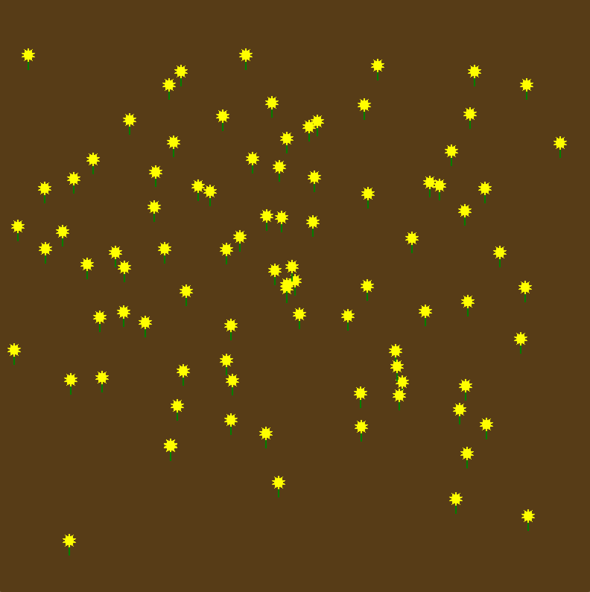
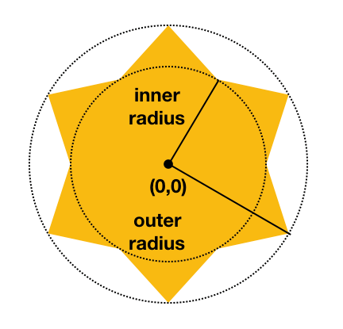

# COMP3170 - Week 5: Mesh Generation and Cameras

In this prac you are going to create a flower garden that looks like this:

To achieve this, you'll need to:
* Generate a flower head mesh.
* Apply matricies using JOML.
* Create a camera with view and projection matricies.
* Utilise mouse input.

Inside the template code for today, you'll see the following classes:
* Week4.java: the base IWindowListener
* Flower.java: code for drawing a flower stem.
* FlowerHead.java: an empty sceneObject class.
* Camera.java: Boilerplate code for a camera class.

Hopefully by now the code should be familiar enough for you to find your own way around. The framework provided draws a single flower stem at (0,0). You task is to complete the parts labelled `TODO` in the code, which we will walk through below.

This task involves combining and testing your knowledge of the unit thus far weeks (including this week's content). If you are stuck, you may wish to revise previous week's work.

## Task 1: Creating a flower
To create the flower, we want to generate the required vertices and link them up based on how many petals are being set (the `nPetals` variable in the code). The flower head should have both an inner and outer radius:

You've been provided a nearly empty `Flowerhead` class to get you started.

The first thing you need to figure out is where should the flowerhead be positioned? What should it be childed to in the scenegraph? Draw this out and discuss with those around you.

We then need to do the hardwork of actually generating the flowerhead mesh based on the amount of petals. There's multiple ways you can approach this problem, each with their own trade-offs. Here's a few ideas to get you started. You could treat this as a single mesh, generating the vertices, transforming them appropraitely and then drawing them using either a suitable form of `glDrawArrays` or an index buffer. Alternatively, you could draw each petal individually, and rotate it around the flowerhead.

Whatever method you choose, do some planning on how you'd achieve it. Creating additional classes is okay here, but remember to properly leverage the scene graph, matrix transformations, and any other tool from the lectures you can think of.

Your instructor will direct you as to discussion.

## Task 2: Add camera
So now we've got a flower! But it's a bit big. Or rather, we're too far zoomed in. We need to create a camera that will allow us to see more of the flower field.

A skeleton `Camera` class has been provided for you. Complete this class (and modify other classes) to:

* Add the camera to the scenegraph. What should it be a child of?
* Set the `viewMatrix` of the camera. What should this be?
* Set the `projectionMatrix` of the camera to use the `zoom` variable. What should this be?
* Pass the view and projection matricies to the driver class. How should they get there, and what does the driver class do with it to pass it down the scene graph?

Once you've done this, you should be able to run your code and see your flower field zoomed in or out. However, when you resize your window, the flower will stretch.

Create a resize function in the camera class that changes the projection matrix whenever the window is resized, taking the aspect ratio into account. Think about how you'd construct this.

## Task 3: Click to spawn
Woohoo, now we've got a great looking flower field! But...there's only one flower!

We want to spawn a new flower at the mouse position whenever the user clicks on the screen. This takes a bit of doing, so let's break it down.

In the driver class, there is an Update method awaiting input with `if (input.wasMouseClicked())`, grabbing the mouse position in screen coordinates and writing it to `position` with 	 `input.getCursorPos(position)`. This will give us the mouse's position in screen space, but we need to do a few more steps before we can use this. The things for you to figure out are:

* How to get from screen space into NDC space. If you can't remember what these values are, Double-check your lecture notes and ask your instructor. What simple equation would allow us to convert a screen space value into NDC (hint: you should be using the `width` and `height` values).
* How do we go from NDC to world space? What matrix that we already have could be used to do this? If you're stuck, try to remember how we get from world space to NDC in the first place.
* Once you have your values, how do you translate a flower when it is spawned so it appears where you want?

Tip: Try printing your x and y values as you go so you can troubleshoot what you are getting.

## Task 4: Camera zoom
It's all well and good to have the camera set-up, but to really test things out we want to change the projection matrix as we are going. Add code to the camera class to change the zoom value when the user presses up or down on the keyboard (there's some commented out code to help you get started).

## Task 5: Animated flower
As a final challenge, try to add some animation to your scene. Make the flower sway left and right, and the flowerhead spin. You can do something else if you'd like, the idea is to breathe some life into the scene.